# python-JioSavanFlaskApiWithDocker

### The objective of this python flask API is to understand the basics of docker and it's functionality with python. 

 

## 1. Create a Flask API 
 
    We have created a simple Flask API which calls the Open Jio Savan Search Songs API and returns the results.

## 2. Define Dockerfile
To enable the docker feature into the project we must add Dockerfile and mention the neccessary steps.

1. Create a file with name Dockerfile (please note there should not be ay kind of extension for this file type)

2. Define Below Content:

        # Let's get the base image for our application 
        FROM python:alpine3.18 as base 

        # Let's define the work directory for our appllication 
        WORKDIR /var/app

        # Setting env variable which will be used by flask 
        ENV FLASK_APP=./src/startup.py
        ENV FLASK_RUN_HOST=0.0.0.0
        ENV JIO_SAVAN_SEARCH_SONG_URL=https://saavn.me/search/songs?query=

        # Copy requirements.txt file to install the dependencies
        COPY requirements.txt requirements.txt

        # Now let's install the dependencies
        RUN pip install -r requirements.txt

        # Exposing the port such that we can run our code
        EXPOSE 5000
        EXPOSE 80
        # Let's copy everything into the WORKDIR
        COPY . .

        # Run the command to execue our file
        CMD ["flask", "run"]

<code> Note: Kindly make sure you have proper formatting for the file.</code>

## 3. Define docker-compose.yml
To enable the multi conatiner concept and having more control ove container we can use docker-compose.yml file and define the neccessary components to it.

Create a file with name docker-compose.yml and define the below content:

    version: "3.9"
    services:

    # creating the service for our application. Like below web service we can have multiple services.
        web:

            # Mentioning the . here, such that compose file will use the image which we mentioned in the docker file 
            build: .

            # Mentioning the image name with tag which will be showing in the docker desktop. We will update this tag with any changes in code.
            image: iamatulkumar/python-jiosavanflaskapi:alpine3.18v1.3

            # Mentioning the container name for our image for easy identification while running it locally
            container_name: python-flaskapi-container

            # binding the ports
            ports:
                - "8000:5000"

            # We are mounting the volume which we are using for our application
            volumes:
                - /D/CodeDesk/gh-iamatulkumar-ya/python-JioSavanFlaskApiWithDocker/:/var/app/
  
<code> Note: Kindly make sure you have proper formatting for the file.</code>

## 4. Build dokcer image and run the container
Open terminal and run below command to build and run the container

    dokcer compose up -d --build
Above command might take a bit of time as it would be setting required thigns for the application.

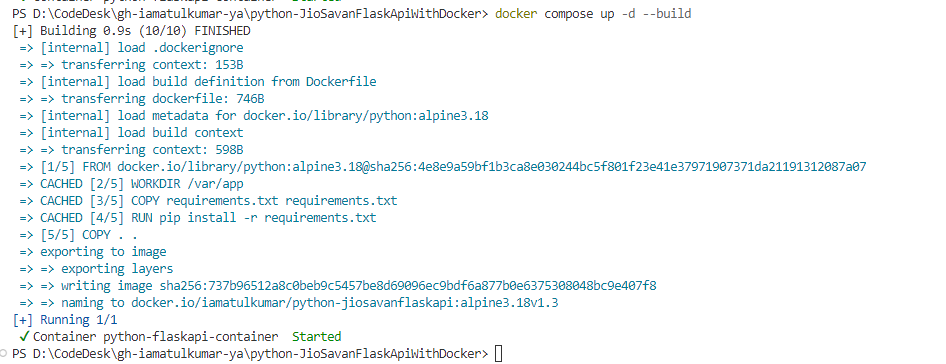

Now, Run below command to check the container status

    dokcer ps
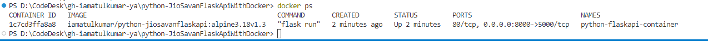

As we can see, the container is running on some port. Let's check same container in docker desktop as well.

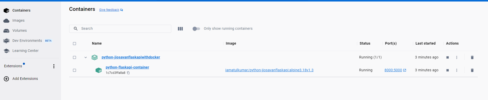

Now, check the API in the browser

    http://localhost:8000

We would see our app is running on the port 8000
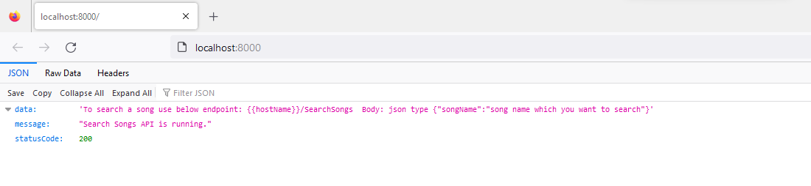

Execute below command to stop the container

    docker compose stop

 
 ## 5. Push docker image into the docker.hub 

 5.1 You must have an account with docker.hub portal.

 5.2 Login into docker dekstop with the credentials.

 5.3 Run below command in the terminal

    docker login

You must see Login Succeeded

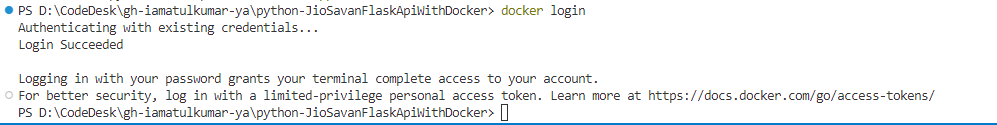

5.4 Then run below command to list the available docker images in local machine

    docker images

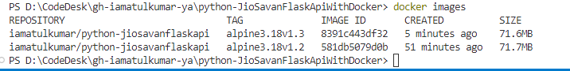

5.5 We have to look into the tag, as v1.3 is latest then we will push that one into docker.hub and to push into portal execute below comamnd 

    docker push iamatulkumar/python-jiosavanflaskapi:alpine3.18v1.3 

you might see different messages 
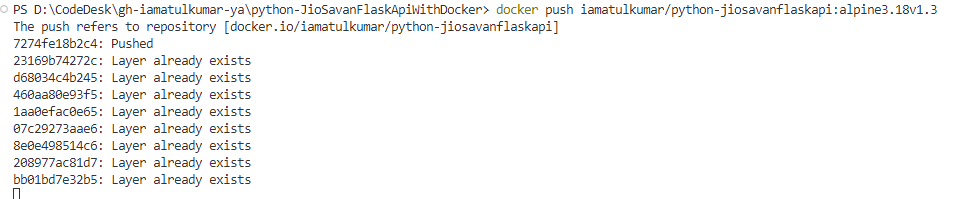

5.6 Let's verify the image in docker.hub portal.

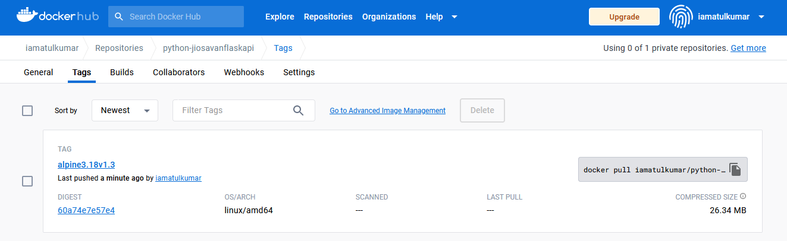

 ## 6. Pull the docker image run it locally

 6.1 TO pull any docker image we must get it's pull command along with tag. so we will pull the image which we pushed recently. But before that, let's delete all images from local machine as it would say it is already present. TO remove we have to run below command 

    docker rmi <<ImageID>>

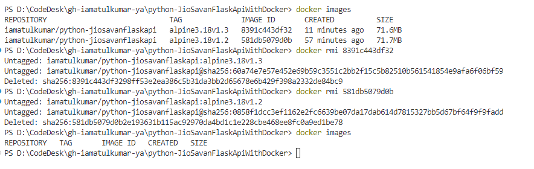

6.2 Let's execute the pull command to get the image into local machine.

    docker pull iamatulkumar/python-jiosavanflaskapi:alpine3.18v1.3

We can get the above command from docker.hub portal

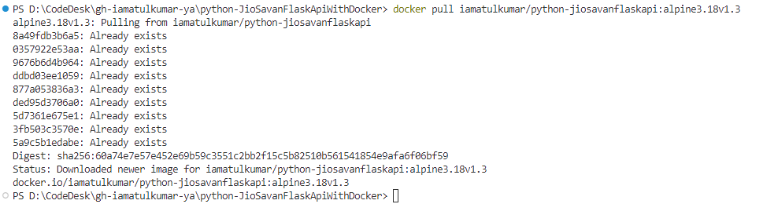

6.3 Execute below command to run the container in specific port

    docker run --name <containerName> -it -d -p 5000:5000 <ImageID>

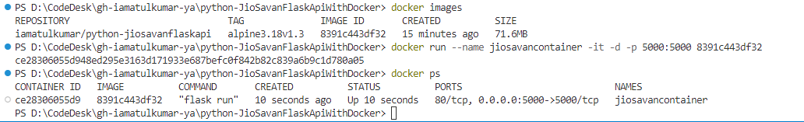

6.4 Open the http://localhost:5000 

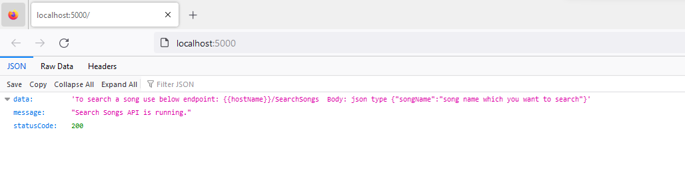

## Thank You
## Happy Learning